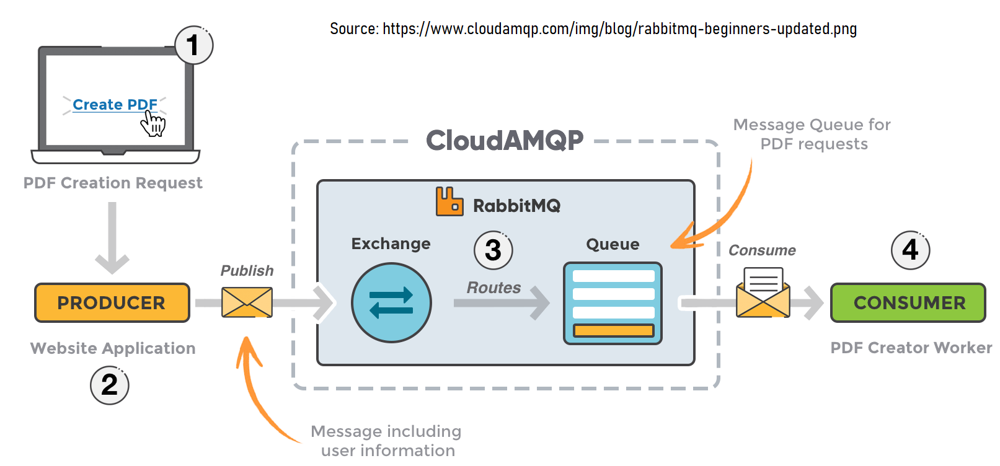

# RabbitMQ

RabbitMQ is a messaging service that is quite popular. It also supports clustering for fault tolerance and scalability.

Messaging Protocols that are popular:

STOMP - Simple Text Oriented Messaging Protocol
- Does not have the concept of queues/topics
- SENDs message to a DESTINATION string

MQTT - Message Queue Telemetry Transport
- IoT connectivity protocol
- Publish-subscribe model
- Specifically designed for resource-constrained devices like Mobile and IoT.

AMQP - Advanced Message Queueing Protocol
- Routing, security with publish-subscribe.




# Usecases

- Real time feed of constantly updating information
- Want to connect different softwares together
- Message delivery after the destination comes online etc..

# Launching

RabbitMQ could be launched with the help of Docker. Use the below command to spawn a Docker container containing RabbitMQ.

```docker run -d --name some-rabbit -p 5672:5672 -p 5673:5673 -p 15672:15672 rabbitmq:3-management```

With this, the portal is accessible via http://localhost:15672/

More one Docker [here](https://github.com/pawanit17/learn_docker).

# Teamcenter_RabbitMQ_Integration

Here, I integrate Teamcenter ( a datasource ) with RabbitMQ ( a messaging queue ).

Teamcenter is a Product Lifecycle Management software and RabbitMQ is a messaging queue. A PLM software would hold the master data in any manufacturing topology and that means that there would be downstream applications where such data is to be replicated to. Examples of these downstream applications include ERP systems like SAP, Analytics softwares like SAP HANA, Reporting softwares like TIBCO Spotfire or to huge data processing softwares like Splunk, you name it.

So this scheme can be applied to any datasource ( say, your home grown Java application that needs to have a certain activity processed in the back end - you could just leverage RabbitMQ to drop a message to the intended backend application that registered with RabbitMQ to do such a processing!.
